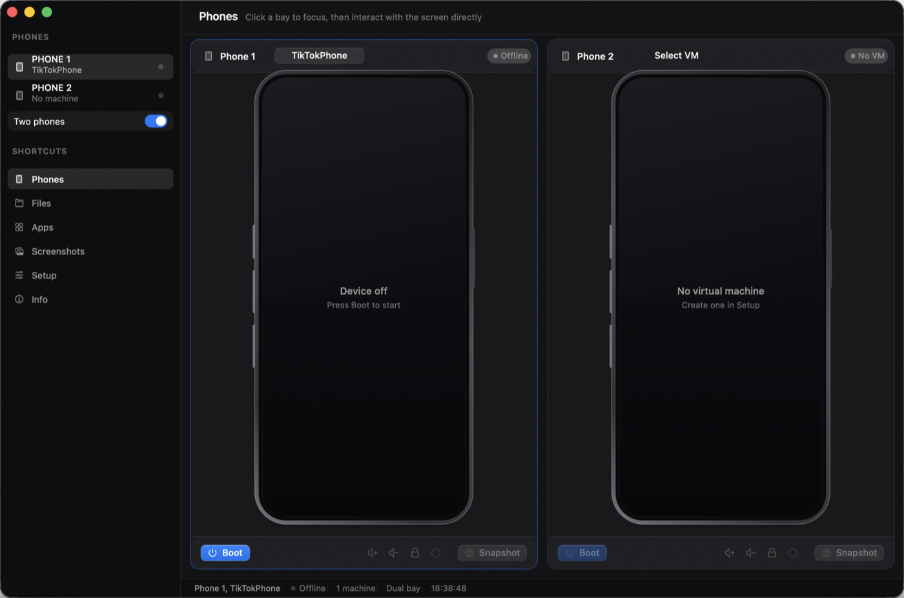

# iPhoneEM

A Mac app for running jailbroken virtual iPhones on Apple Silicon.

It is a window around [vphone-cli](https://github.com/Lakr233/vphone-cli). That project does the real
work: it boots actual iOS firmware in a virtual machine and installs a jailbreak into the guest. It is
a command line tool, and I kept forgetting the flags, so this puts a UI on it.



There is a 20 second demo in `brag-output/brag.mp4`, and the copy for it in `brag-output/share-copy.txt`.

## What is in the window

The sidebar has six shortcuts. The first one is the reason the app exists.

**Phones** shows the device bays. One bay by default, two if you flip the "Two phones" switch. Each
bay has Boot, Stop, Home, Lock, volume and Snapshot, and shows the live screen, so you can tap and
swipe in it like a real phone. Drag an .ipa onto a bay to install it. Right click on the screen is the
home button.

The rest:

- **Files** browses the phone's own file system. Upload, download, new folder, delete.
- **Apps** lists installed applications and can launch, terminate or install packages.
- **Screenshots** keeps captures in `~/Pictures/iPhoneEM`.
- **Setup** checks the host, manages the machine library and shows the engine's output in a console.
- **Info** has paths, the UDID and IP of each phone, the SSH command and a clipboard bridge.

Two bays run two machines at the same time, each with its own disk, so they are really separate
phones. You need a second machine for that: Setup can clone one in a few seconds.

## Requirements

- Apple Silicon Mac, macOS 15 or newer, Xcode command line tools
- `brew install aria2 gnu-tar openssl@3 ldid-procursus sshpass zstd cmake keystone python@3.13 wget libusb ipsw`
- SIP and AMFI have to be relaxed. Apple requires this for these virtual machines and no app can do it
  for you:
  1. Reboot into Recovery (hold the power button), open Terminal and run:
     ```
     csrutil disable
     csrutil allow-research-guests enable
     ```
  2. Back in macOS, then reboot again:
     ```
     sudo nvram boot-args="amfi_get_out_of_my_way=1"
     ```

Setup shows the live status of both. Without them the app still opens, but nothing will boot.

## Build

```sh
./build.sh                 # fetches the engine, applies the UI, installs to /Applications
./build.sh --no-install    # stops after dist/iPhoneEM.app
VPHONE_ENGINE=~/vphone-cli ./build.sh   # use your own engine checkout
```

The engine is pinned to a commit I tested and lands in `.build/engine`. The firmware pipeline needs
some extra tools on the host, once:

```sh
cd .build/engine && ./scripts/setup_tools.sh
```

## Running a phone

1. Setup, type a name like `myphone`, leave the variant on `jb`, press Create Phone. The console shows
   what is happening: it downloads the firmware, patches the boot chain, restores over DFU, installs
   the jailbreak and boots once to finish. The firmware is cached in `~/.vphone/ipsws`, so a second
   machine goes faster. macOS asks for your password once, for the CFW step.
2. Phones, pick your machine, press Boot. During the iOS setup wizard pick a region other than Japan or
   the EU, otherwise system apps refuse to install. Sileo and TrollStore show up on their own with the
   `jb` variant.
3. SSH into the guest with `ssh -p 22222 mobile@<ip>`, password `alpine`. The IP is on the Info page.

Clone the machine in Setup if you want the second bay to show a different phone.

## Where your stuff is stored

Everything lives in `~/.vphone/VMs/<name>/`: `Disk.img` (sparse, 64 GB by default), `nvram.bin`,
`SEPStorage` and `config.plist`. The guest writes straight into that disk, so apps you install, files
you drop in and settings you change are still there next time.

Stopping a phone is a hard power off from the host side. iOS recovers through its journal on the next
boot, but it is a cold boot every time: the engine has no suspend, so you always come back to the lock
screen instead of the screen you left. Shutting down from inside iOS is cleaner if you care about that.

Deleting a machine in Setup deletes the whole folder, so that is the one button to be careful with.

## Repo layout

```
build.sh                     fetch engine, apply UI, build, sign, bundle, install
overlay/sources/vphone-cli/  the UI sources, copied into the engine build (EM*.swift)
patches/                     the two engine edits the app needs
app/EMInfo.plist             bundle metadata
tools/em_icon.swift          renders the app icon
docs/screenshot.png          the picture above
scripts/sync-from-engine.sh  writes UI changes back from an engine checkout
```

## How it works

Every bay boots its own `VPhoneVirtualMachine` inside the app process and draws it with a
`VZVirtualMachineView` subclass that turns mouse events into touches in the guest. Guest features like
the file browser, the app list and the clipboard go through the engine's vsock channel to the
`vphoned` daemon that runs inside iOS. Commands for the library and the host checks run the same binary
as a child process, and their output goes into the Setup console.

The two engine edits are small: one routes a launch without arguments to the UI, the other stops the
process from exiting when a guest shuts down, because with two machines one of them stopping should not
take the app with it.

## Credits

The engine is [Lakr233/vphone-cli](https://github.com/Lakr233/vphone-cli), MIT, and the research behind
it comes from [wh1te4ever/super-tart-vphone-writeup](https://github.com/wh1te4ever/super-tart-vphone-writeup).
What I wrote is the UI, the build script and the icon: MIT, see [LICENSE](LICENSE).

Not affiliated with Apple. These are research VMs, so use them on hardware you own and respect the
licences of whatever you install on the guest.
